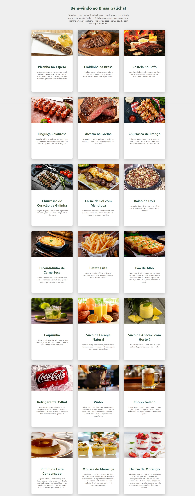

# Brasa Gaúcha - Churrascaria Tradicional

Bem-vindo ao meu primeiro projeto em ReactJS. Este projeto foi desenvolvido utilizando ReactJS e Styled Components, além de abordar Listas e Objetos e uma interface responsiva. Brasa Gaúcha, foi o nome que eu pensei para criar uma churrascaria ficticia e o seu cardapio!

## Tecnologias Utilizadas

- **ReactJS**: Framework JavaScript para construir interfaces de usuário interativas e eficientes.
- **Styled Components**: Biblioteca para estilização de componentes com CSS-in-JS, proporcionando uma abordagem modular e reutilizável para o design.
- **Cards**: Utilização de cards para uma apresentação atraente e intuitiva das informações e imagens dos nossos pratos.

## Funcionalidades

- **Design Responsivo**: A interface é otimizada para funcionar bem em dispositivos móveis e desktops.

## Apresentação:



## :information_source: Instalação

### Pré-requisitos

Antes de começar, certifique-se de que você tem as seguintes ferramentas instaladas:

- **Node.js**: Necessário para executar o projeto. Você pode baixar a versão mais recente [aqui](https://nodejs.org/).
- **Git**: Necessário para clonar o repositório. Você pode baixar a versão mais recente [aqui](https://git-scm.com/).

Siga os passos abaixo para configurar o projeto:

```bash
# Clone o repositório:
$ git clone https://github.com/Kaique-Parente/ExerciciosReactJS.git

# Navegue até o diretório do projeto:
$ cd ExerciciosReactJS/exercicio01

# Instale as dependências:
$ npm install

# Inicie o servidor de desenvolvimento:
$ npm start

# Abra seu navegador e acesse:
$ http://localhost:3000
```

## Licença

Este projeto está licenciado sob a [MIT License](https://github.com/Kaique-Parente/ExerciciosReactJS/blob/main/LICENSE). 📜
