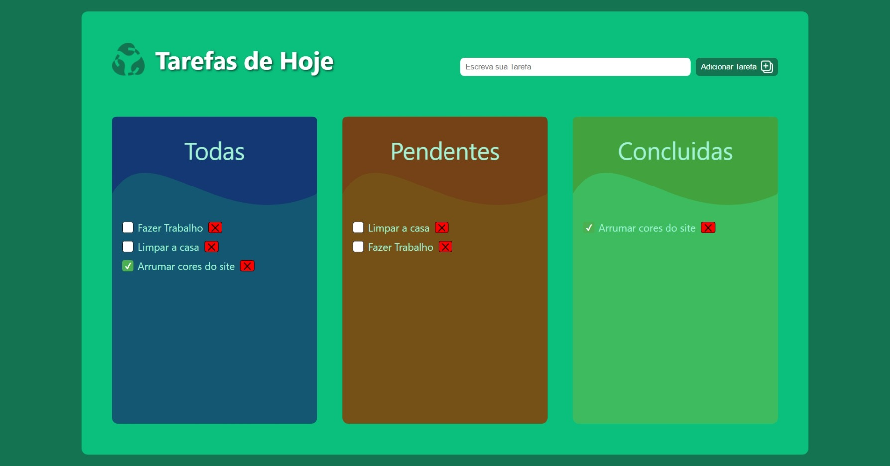
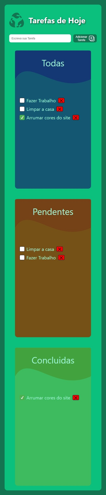

# Lista de Tarefas To Do

Bem-vindo ao meu segundo projeto em ReactJS! Nesta aplicação, estou explorando o uso do **useState**  e de **eventos** para gerenciar uma lista de tarefas. O projeto permite adicionar e remover tarefas.

Desenvolvi o projeto utilizando ReactJS e Styled Components para criar uma interface responsiva e estilizada.

## Tecnologias Utilizadas

- **ReactJS**: Framework JavaScript para construir interfaces de usuário interativas e eficientes.
- **UseState**: Hook do ReactJS que permite adicionar e gerenciar estados em componentes funcionais, possibilitando a criação de interfaces dinâmicas e responsivas.
- **Styled Components**: Biblioteca para estilização de componentes com CSS-in-JS, proporcionando uma abordagem modular e reutilizável para o design.
- **Cards**: Utilização de cards para uma apresentação atraente e intuitiva das informações e imagens dos nossos pratos.

## Funcionalidades

- **Design Responsivo**: A interface é otimizada para funcionar bem em dispositivos móveis e desktops.

## Apresentação:

<div style="display: flex; 
    height: 200px">
    
    
</div>

## :information_source: Instalação

### Pré-requisitos

Antes de começar, certifique-se de que você tem as seguintes ferramentas instaladas:

- **Node.js**: Necessário para executar o projeto. Você pode baixar a versão mais recente [aqui](https://nodejs.org/).
- **Git**: Necessário para clonar o repositório. Você pode baixar a versão mais recente [aqui](https://git-scm.com/).

Siga os passos abaixo para configurar o projeto:

```bash
# Clone o repositório:
$ git clone https://github.com/Kaique-Parente/ExerciciosReactJS.git

# Navegue até o diretório do projeto:
$ cd ExerciciosReactJS/exercicio01

# Instale as dependências:
$ npm install

# Inicie o servidor de desenvolvimento:
$ npm start

# Abra seu navegador e acesse:
$ http://localhost:3000
```

## :memo: Licença

Este projeto está licenciado sob a [MIT License](https://github.com/Kaique-Parente/ExerciciosReactJS/blob/main/LICENSE). 📜
